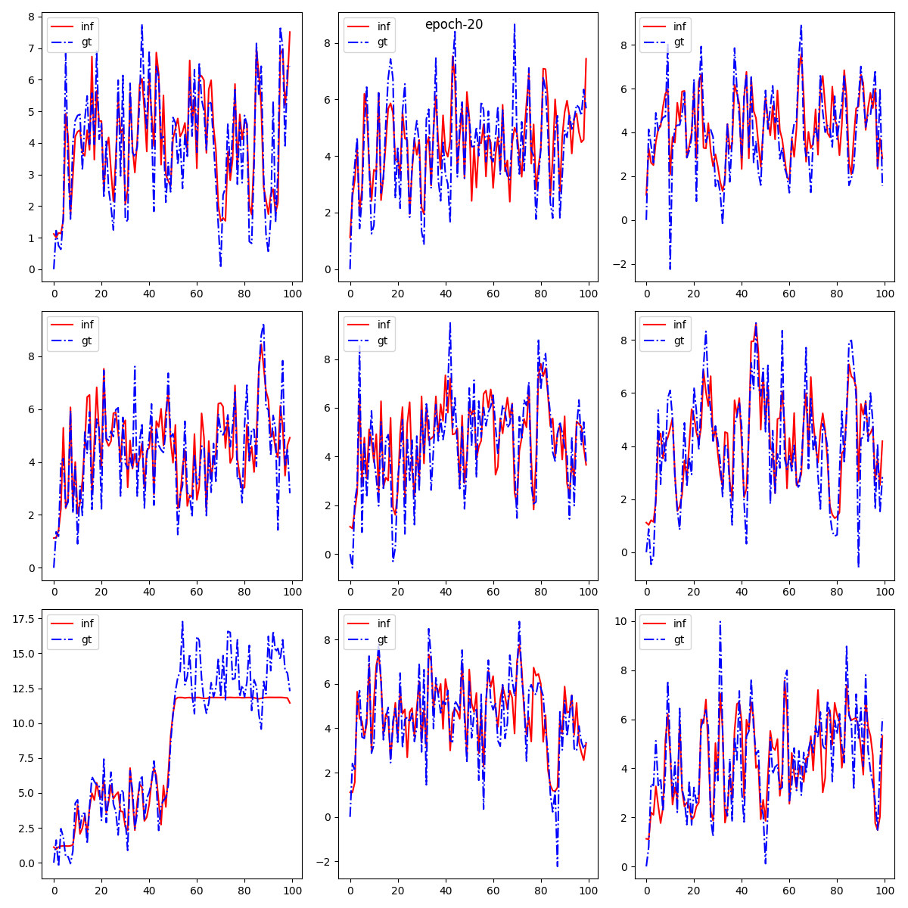
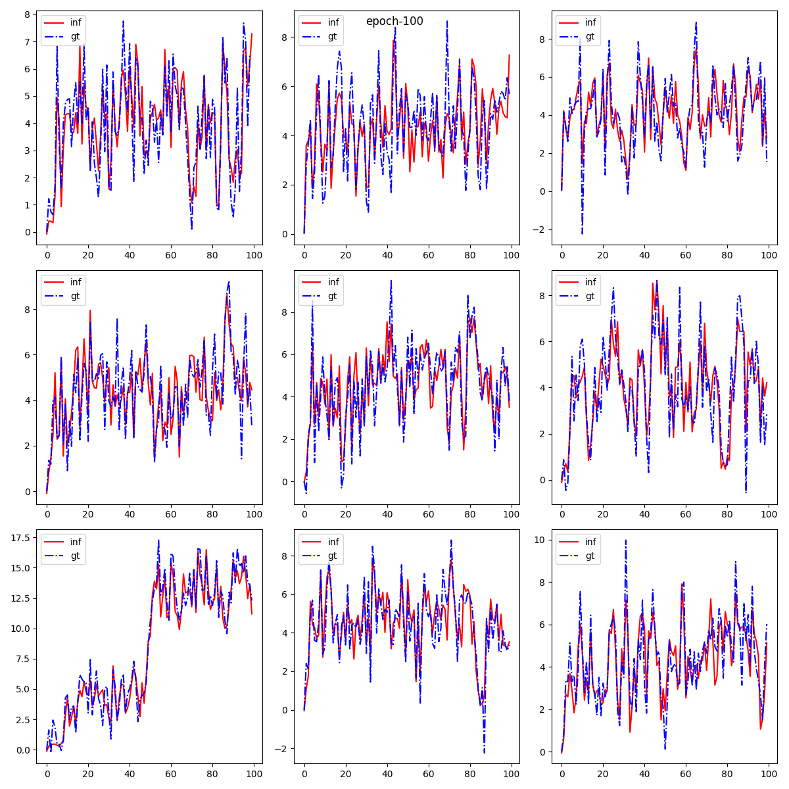
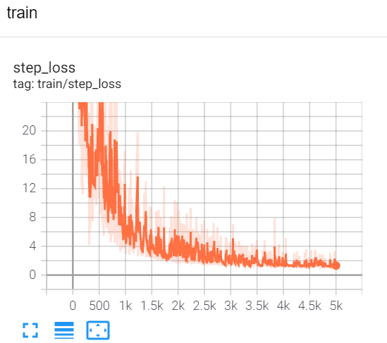
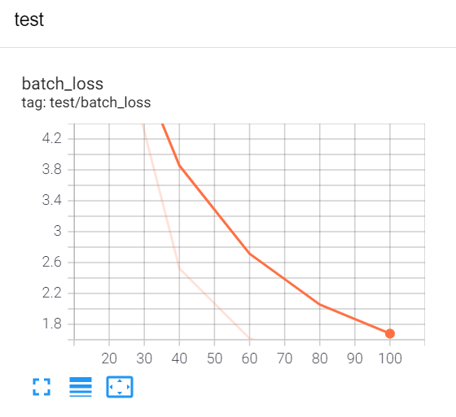

## Read Me

### 1. Problem formulation
Consider the following time series problem

$$
\left \{
\begin{aligned} 
x_1(n) &= x_1(n-1) + sin(x_1(n-1)) + w_1(n), \\
x_2(n) &= x_1(n-1) + cos(x_2(n-1)) + w_2(n), \\
y(n) &= \sqrt {x_1^2(n)+x_2^2(n)} + v(n)
\end{aligned} 
\right .
$$
where $w_1$, $w_2$ and $v$ are mutual independent standard Gaussian white noises.

### 2. Goal
Suppose we don't know what the system dynamic, we have only a dataset $D_{train}=\{ x^{(i)}, y^{(i)} \}_{i=1}^N$, we want to make predictions for unkonwn trajectories $D_{test}=\{ x^{(i)}, y^{(i)} \}_{i=1}^m$.

### 3. Method
We use RNN to solve this problem.
#### 3.1 Model
We use a sample RNN model with only one layer, bidirectional. The number of hidden units are 10. We use MSE loss as performance metric for this task.
```
class my_rnn_net(nn.Module):
    def __init__(self):
        super(my_rnn_net,self).__init__()
        self.rnn = nn.RNN(input_size=2,hidden_size=10,num_layers=1,nonlinearity='tanh',bias=True,batch_first=True,bidirectional=True)

        self.fc = nn.Linear(in_features=20,out_features=1)

    def forward(self,seq):
        H,hn = self.rnn(seq)
        Y = self.fc(H)

        return Y
```

#### 3.2 Experiment setting
* train_num: 1000
* test_num: 100
* optimizer: Adam
* learning_rate: 0.001
* seq_len: 100 
* batch_size: 20
  
We do inference after training every 20 epochs.

### 4. Results
Here we show some experiment results. 

#### 4.1 Predictions
Predictions of 9 trajectories of the testset are shown below.

Epoch = 20


Epoch = 60


Epoch = 100


#### 4.2 Losses
* train step loss



* test batch loss



### 5. Conclusion
We can see that a very sample RNN can predict the model very well, after only 100 epochs training.


